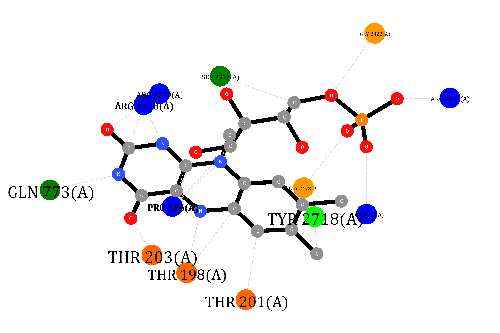

# Molecular Docking and Data Visualization

Visual plot of the molecule docing ligand and amino acid residues:

```vbnet
Dim pdb As PDB = PDB.Load("8qne.pdb")
Dim theme As New Theme With {
    .padding = "padding: 10% 10% 10% 10%;"
}

For Each ligand In pdb.ListLigands
    Dim render As New Ligand2DPlot(pdb, ligand, theme)
    render.CalculateMaxPlainView()
    Dim image = render.Plot("3600,2400").AsGDIImage

    Call image.SaveAs($"./{ligand.Name} ~ {ligand.Description}.png")
Next
```




